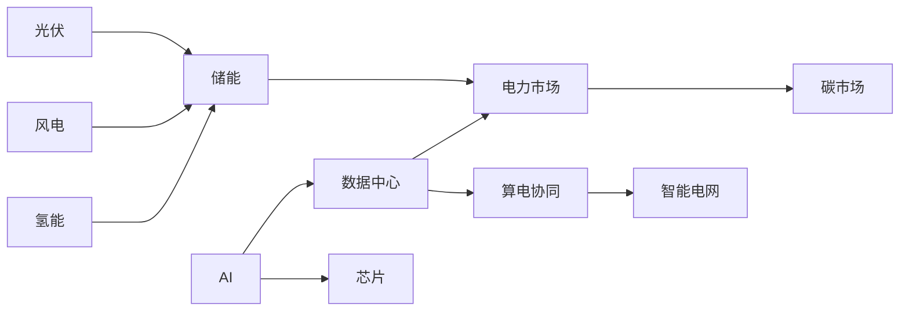

## 赛道交叉图谱

能源赛道之间的交叉关系日益紧密，形成了一个互相影响、互相制约的价值网络。

## 最近的深化研究

- [算电协同进入落地期：从用户需求推演投资逻辑](/AI/_回流_2026-06-12_算电协同进入落地期-从用户需求推演投资逻辑)
- [电改2.0落地时间表](/算电协同/_深化_2026-06-13_电改2.0落地时间表)
- [数据中心需求响应收益测算](/算电协同/_深化_2026-06-13_数据中心需求响应收益测算)
- [节能用能体系深度分析](/算电协同/节能用能体系深度分析)

---

*知识库由 AI 辅助构建与维护 · 内容仅供参考，不构成投资建议*
