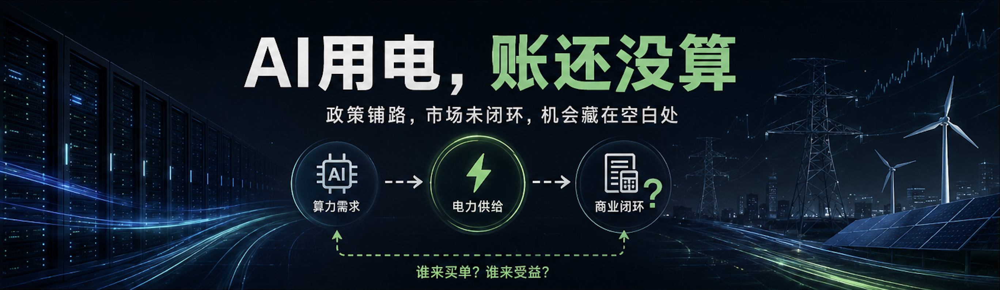
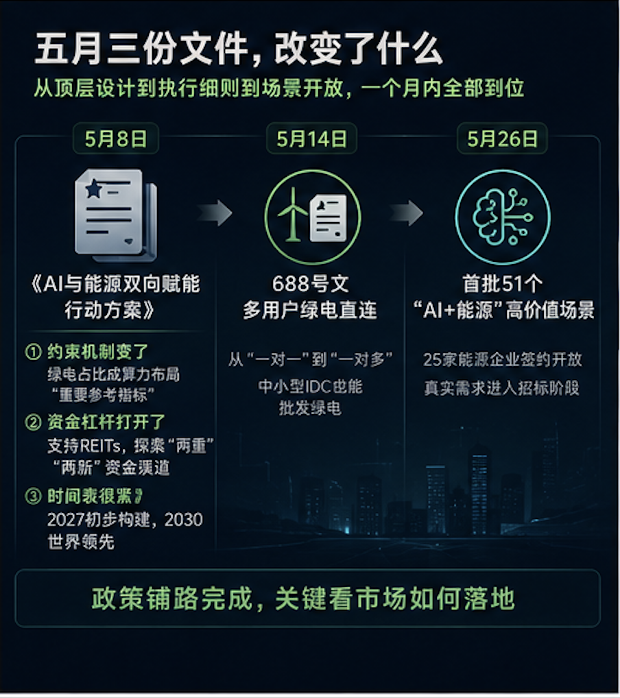
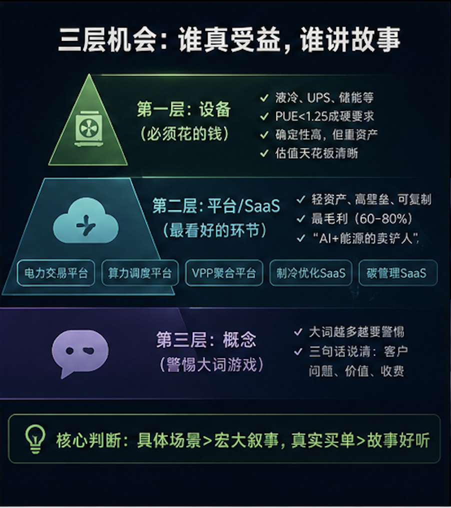
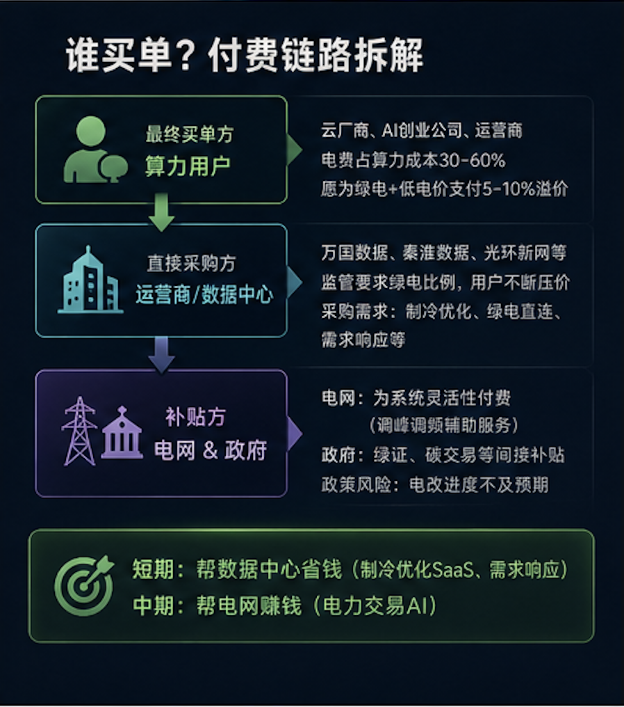

上周和一个做数据中心运维的朋友吃饭，他跟我说了一句话，让我想了好几天。

"我们现在最怕的不是没电，是电来了不知道怎么报价。"

他所在的IDC刚拿到绿电直连资质——688号文多用户模式让他们这类中型数据中心也能批发绿电了——但问题是，现货市场电价一天波动96次，人工根本盯不住。省下来的电费，一部分又漏在了报价上。

这恰好点出了当前AI+能源赛道最关键的问题：

**政策到了，但市场还没跟上。**

准确地说——政策已经铺好了路，但"谁买单"这个核心问题还没闭环。

---

### 五月，三份文件改变了什么

过去一个月，政策密度在AI和能源两个领域都算罕见。

5月8日，国家发改委、国家能源局、工信部、国家数据局联合发布《关于促进人工智能与能源双向赋能的行动方案》。29项重点任务，完整覆盖了"源-网-荷-储"全链条——从西部的算力枢纽到园区的微电网，第一次把算力和电力作为一个系统来规划。

真正值得关注的有三处：

> **① 约束机制变了。** 文件首次把"绿电使用占比"列为算力设施布局的"重要参考指标"。翻译过来：以后建数据中心，绿电比例不达标可能批不下来。
>
> **② 资金杠杆打开了。** 明确支持算力设施申报基础设施REITs，探索"两重""两新"资金渠道。国家级的廉价长期资本正在向这个方向倾斜。
>
> **③ 时间表很紧。** 2027年初步构建，2030年达到世界领先水平——留给市场准备的时间只有三到四年。

5月14日，688号文《关于有序推动多用户绿电直连发展有关事项的通知》落地。这个文件看起来像是650号文的"小升级"，但商业含义远比字面大——绿电直连从"一对一"变成了"一对多"。

以前一个风光电站只能服务一个用户，你必须找到科技巨头那种体量的单一买家。现在可以同时服务多个数据中心，甚至一个园区。中小型IDC第一次有了"批发绿电"的可能。

5月26日，国家能源局发布了首批51个"AI+能源"高价值场景，25家能源企业签约开放。新能源出力预测、现货市场报价、电网故障自愈——这些不是实验室课题，是已经进入招标阶段的真实需求。

三份文件，从顶层设计到执行细则到场景开放，一个月内全部到位。

---

### 三层机会：谁真受益，谁讲故事

把政策拆开看，受益的环节可以归为三层。

#### 第一层：设备

液冷散热、高效UPS、储能系统——政策对新建数据中心能效的要求越来越严（PUE<1.25），这些是必须花的钱。确定性很高。

问题是，设备是一级市场投着最不舒服的环节。重资产、增长受产能限制、估值天花板清晰。液冷做得好的英维克在二级市场，一级确实缺乏优质标的。

唯一的例外是浸没式液冷——技术路线还没收敛，存在"赌对"的超额回报机会。NVIDIA Rubin全液冷路线确认后，这个方向的关注度在快速上升。

#### 第二层：平台/SaaS——我最看好的环节

AI电力交易平台、算力调度平台、VPP聚合平台、AI制冷优化SaaS、碳管理SaaS——我称之为"AI+能源的卖铲人"。

这类公司的共同画像：

- **轻资产**——不需要建厂房
- **高壁垒**——护城河来自算法+真实数据+客户粘性
- **可复制**——边际成本趋近于零
- **高毛利**——60-80%是合理预期

但这层的陷阱也不小。

很多公司说自己在做"AI电力交易"，实际只是给电网做定制项目，不是可规模化的SaaS产品。真实壁垒不是AI算法——那玩意儿门槛在快速降低——而是：

1. 能不能拿到真实交易数据？（电网不会轻易开放）
2. 能不能跑通实盘？（回测好和实盘赚钱是两码事）
3. 能不能形成数据飞轮？（用得越多模型越准）

#### 第三层：概念

"AI赋能能源""智慧能源大脑""能源元宇宙"——大词越多越要警惕。

判断标准很简单：创业者能不能在三句话内说清客户是谁、解决什么问题、怎么收费。不能的，大概率还在PPT阶段。

电力行业有个特点：极度排外。跨界团队需要回答一个灵魂问题——"凭什么电网/发电集团选你，而不是选他们体系内的供应商？"如果答案是"因为我们AI更厉害"，那大概率没想清楚。

---

### 谁买单——最根本的问题

政策的利好是确定的。但落到商业模式，必须回到那个根本问题：

**最终谁付钱？**

拆一下付费链：

**最终买单方是算力用户。** 云厂商、AI创业公司、运营商——他们为算力付费，其中30-60%是电费。他们愿意为"绿电+低电价"支付溢价，但上限5-10%，再高就不划算了。

**运营商的账本最敏感。** 万国数据、秦淮数据、光环新网——他们夹在中间。一面是监管对绿电比例的硬要求，一面是算力用户不断压价。他们是需求响应、绿电直连、AI制冷优化的直接采购方。帮他们省钱，就能收到钱。

**电网和政府是补贴方。** 电网为系统灵活性付费（调峰调频辅助服务），政府通过绿证、碳交易间接补贴。但这部分有政策风险——电改进度可能不及预期。

> **我的判断：** 短期付费确定性最高的是"帮数据中心省钱"的模式——AI制冷优化SaaS和需求响应平台。中期"帮电网赚钱"的模式（电力交易AI）会爆发。两个窗口期不同，但方向是确定的。

---

### 最大的机会藏在空白处

标的梳理下来，算电协同赛道现有玩家的分布是这样的：

| 子赛道 | 代表标的 | 阶段 | 投资时点 |
|--------|---------|------|---------|
| AI电力交易 | 瓦特智能（B轮）、清大科越（Pre-IPO） | 已有实盘 | ✅ 窗口期 |
| VPP聚合 | 电享科技（A轮） | 试点项目 | ✅ 早期 |
| 算力调度 | 算力互联（B轮）、星链算力（A轮） | 产品化 | ✅ 窗口期 |
| 液冷散热 | 英维克（上市）、高澜股份（上市） | 成熟 | 二级市场 |
| **AI制冷优化SaaS** | **国内空白** | **无对标** | ⭐ **最佳窗口** |
| 碳管理SaaS | 无算电协同聚焦标的 | 空白 | ⭐ 关注 |

最有意思的是最后两行。

AI制冷优化SaaS，在海外已经有Phaidra这样的公司跑通了——帮Google降低30%制冷能耗。国内数据中心节能市场比海外更迫切（政策PUE<1.25比欧美更严），但专注这个方向的独立公司，一个都没有。

这是一级市场该出手的地方——在市场意识到之前，找到能打的那个团队。

---

### 三点建议

> **对PE/VC同行：** 优先看平台/SaaS。尽调时死磕三个问题——数据从哪来？实盘赚没赚钱？客户续不续约？对"宏大叙事"保持警惕，对"具体场景"保持敏感。
>
> **对创业者：** 别做"AI+能源平台"——太大了你扛不住。选一个具体场景死磕到底：现货报价、制冷优化、需求响应，三个方向都有真实买单的需求。先拿下一个大客户——在电力行业，最好的销售就是头部客户案例。
>
> **对我自己：** 我会持续跟踪AI制冷优化SaaS方向的团队，这是目前算电协同赛道最大的盲点，也是最有机会出手的方向。

---

*数据截止：2026年6月25日*
*本文仅代表个人观点，不构成投资建议。投资有风险，决策需谨慎。*

---

*觉得有启发？点个"在看"，让更多人看到不一样的投资视角。*
