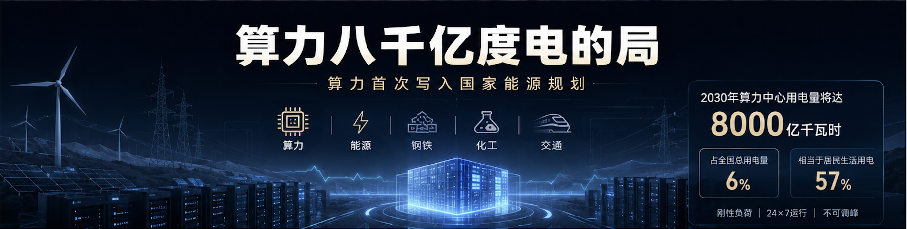
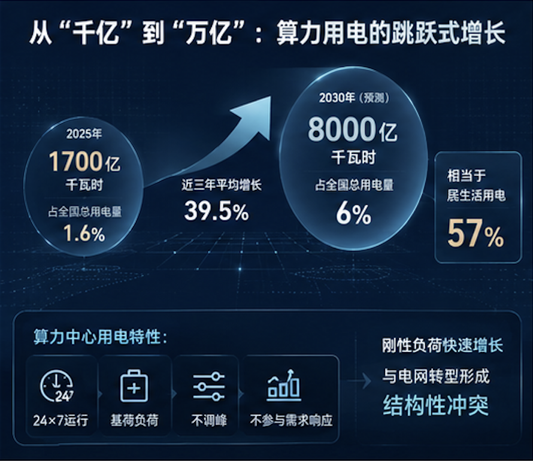
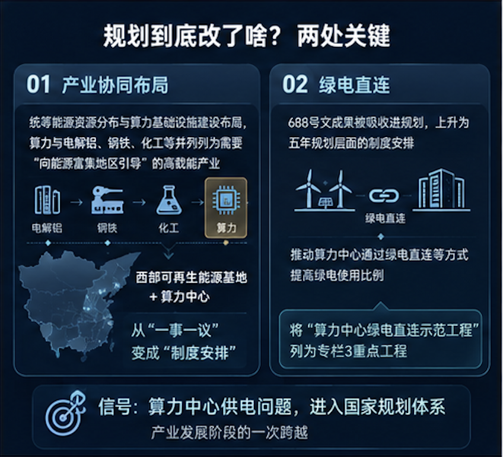
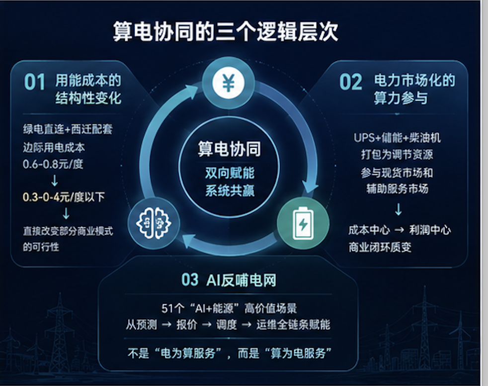

上周三，十五五能源规划发了。如果你只翻了通稿，可能觉得和之前差不多——非化石能源50%、新型储能3亿千瓦，都是老目标。但有一处不一样：规划里第一次出现了"算力"这个词。不是"数据中心"，不是"信息产业"，是算力——和钢铁、化工、交通并列，写进了国家能源规划的产业协同章节。

这个变化，不是文字游戏。

---

## 一、从"千亿"到"万亿"：算力用电的跳跃式增长

先看一组数据。

2025年，中国算力中心总用电量约1700亿千瓦时，占全国总用电量的1.6%。这个数字本身不大，但增长率惊人——国家枢纽节点算力用电近三年平均增长39.5%。

国家电网的预测是：2030年算力中心用电量将达到约8000亿千瓦时，占比升至6%。

8000亿千瓦时是什么概念？2025年全中国的居民生活用电总量约14000亿千瓦时。也就是说，五年后算力中心一个"行业"的用电量，将相当于全中国居民生活用电的57%。

不只是量的问题，还有质的问题。

算力中心是24×7的基荷负荷，几乎不调峰、不参与需求响应。它对电网来说是一个"刚性负担"——不像空调这种可以适当上调温度来减载的柔性负荷，算力中心的功率曲线几乎是一条直线。

当一个占全社会用电量6%的刚性负荷快速增长，而电网结构本身正在经历新能源占比急速提升的转型，冲突是结构性的。这就是十五五规划为什么要把算力写进去——不是因为算力"重要"，而是因为算力和电网都到了一个靠自身无法调和的阈值。

---

## 二、规划到底改了啥？两处关键

**一是产业协同布局。** 规划明确提出"统筹能源资源分布与算力基础设施建设布局"，算力与电解铝、钢铁、化工等被并列列为需要"向能源富集地区引导"的高载能产业。

这句话翻译成投资语言：**西部可再生能源基地+算力中心的组合，从"一事一议"变成了"制度安排"。**

以前数据中心西迁靠的是地方政府招商——电价补贴、土地优惠。现在有了国家规划的顶层依据，算力中心建设节奏和电力基础设施的配套节奏打通了：你不再需要等电网来扩容，而是规划同步。

大唐中卫200万千瓦算电协同项目就是这种模式的一个样本。风光储一体化直供数据中心，度电成本控制在0.25元以内，远比东部大工业电价有竞争力。

**二是绿电直连。** 688号文（多用户绿电直连）的成果被直接吸收进规划，上升为五年规划层面的制度安排。规划明确"推动算力中心通过绿电直连等方式提高绿电使用比例"，并将"算力中心绿电直连示范工程"列为专栏3的重点工程。

两条加在一起，传递的信号是：**算力中心的供电问题，不再留给市场自己解决，而是进入了国家的规划体系。** 在制度经济学意义上，这是产业发展阶段的一次跨越。

---

## 三、算电协同的三个逻辑层次

如果只把这件事理解成"利好算电协同概念"，那就浪费了这个信号。

### 逻辑一：用能成本的结构性变化

算力中心的核心成本就是两个：设备折旧（~50%）+ 电费（~30-60%）。当电费占比高到一定程度，用电成本就不是运营问题，而是商业模式问题。

绿电直连+西迁配套能直接把边际用电成本从0.6-0.8元/度降到0.3-0.4元/度以下。这个量级的变化，可以直接改变某些商业模式的可行性——比如AI推理的边缘节点部署、比如中低端算力的出口。

### 逻辑二：电力市场化的算力参与

规划明确"完善电力市场体系，支持虚拟电厂、储能、负荷聚合商等新型主体参与市场"。这句话和算力直接相关。数据中心的备用UPS和柴油发电机，本质上是优质的调节资源。一个10MW的数据中心如果配置了2MW的UPS储能，理论上可以响应电网调度，在现货市场赚取辅助服务费用。

大唐中卫项目的另一个看点是：它不仅在绿电直连，还在搭建"算力+储能+虚拟电厂"的综合能源系统。数据中心从"成本中心"变成"利润中心"——这个逻辑一旦跑通，对算电协同的商业闭环是质变。

### 逻辑三：AI反哺电网

规划中"人工智能+"能源行动是一个容易被忽略但长期最重要的方向。51个"AI+能源"高价值场景已经发布，从新能源出力预测到现货市场报价到电网故障自愈。这是算电协同的另一面——不是"电为算服务"，而是"算为电服务"。电力系统有刚性需求（调度优化、设备巡检、负荷预测），AI有成熟方案，缺口在于中间件和工程化能力。

这恰好是PE/VC可以布局的环节：不是在底层基础设施上和央企竞争，而是在应用层找能跑通场景闭环的团队。

---

## 四、四个投资机会

**1. 绿电直连/微电网解决方案。** 规划把绿电直连上升为制度安排后，算力中心+新能源的"微电网+大电网"混合供电模式会加速落地。关注有风光储一体化项目运营经验的团队。

**2. 数据中心虚拟电厂（VPP）。** 数据中心作为电力市场新型主体的政策窗口已经打开。关键在于谁能把"UPS+柴油机+储能"打包成标准化的响应产品，参与现货市场和辅助服务市场。技术和运营的双门槛，先跑通闭环的团队有先发优势。

**3. AI+电力交易/调度。** 现货市场日均96次报价，人工报价体系已经到极限。AI策略的优势不是锦上添花，而是降维打击。这个方向需要懂电力和懂AI的复合团队，稀缺性决定了估值溢价。

**4. 算力中心节能技术。** 这是一个被忽视的稳定赛道。规划对算力中心能效有明确的考核导向，存量数据中心的节能改造是千亿级别的市场。液冷、高效UPS、余热回收——确定性强，适合PE风格。

---

## 五、风险

**配电网承载能力。** 规划要求2030年配电网承载9亿千瓦分布式新能源，当前电网投资节奏和架构能否跟上？这是系统性的执行风险。

**政策落地速度。** "十五五"能源投资超20万亿，但算电协同能分到多少？绿电直连的"一对多"在制度上已无障碍，但跨省交易、网间结算、容量电价等细则决定了"政策利好→真金白银"的距离。

**最终买单方。** 算力中心绿电直连降了电费，降下来的成本是留在运营商还是传导到下游？算力价格弹性如何？这会影响整个赛道的利润空间。

---

## 六、一个判断

2026年6月25日，算力被写入能源规划。这不一定是立刻能赚钱的事件，但它是资产重定价的起点：**算力不再只是一个IT概念，它进入了国家能源账户的核算体系。**

对于一级市场投资者来说，这意味着三件事：

第一，算电协同正在从"早期赛道"变为"制度驱动的成长赛道"。赛道存在性风险在降低，成长节奏和竞争格局变成关键。

第二，投资视角需要从"项目思维"切换到"系统思维"。算力和电力的耦合不是单一技术或单一项目能解决的，需要从源网荷储全链条来理解风险点和利润点。

第三，窗口期可能比想象中短。规划执行周期是2026-2030年，政策红利集中在明后两年。有验证案例、有收入数据、有团队沉淀的公司，会在这段时间快速拉开差距。

算力进了能源的局。八千亿度电的局，牌已经开始洗了。

---

*本文仅代表个人观点，不构成投资建议。数据来源：国家发改委/国家能源局《新型能源体系建设"十五五"规划》、国家电网、中国电力企业联合会公开数据。*
